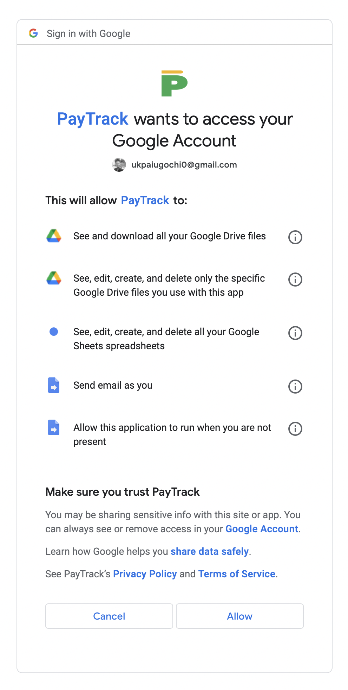
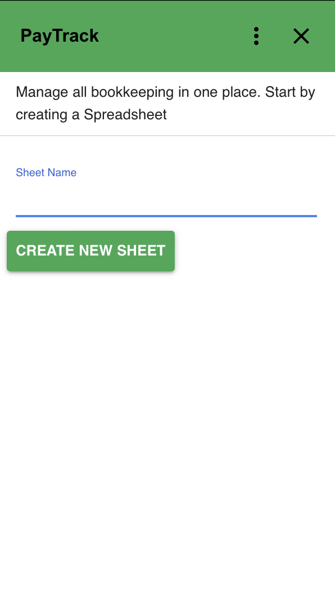

# Installation

This is the installation guide for PayTrack. Please note that this is a Google addon and it is required that you have a Google account before you can proceed. If you don't have a Google account, you can create one [here]().

Now, install PayTrack from [Google Marketplace](https://workspace.google.com/marketplace/app/paytrack/913987535189). Here, you will be required to give access via authorization of scopes. 

- See and download all your Google Drive files

- See, edit, create, and delete only the specific Google Drive files you use with this app

- See, edit, create, and delete all your Google Sheets spreadsheets

- Send email as you

- Allow this application to run when you are not present

## What Is Next?
After installation, you can find the PayTrack icon at the right hand side of your Drive App. Create a new file to record your transaction from your Drive.

You can not use PayTrack without creating an accounting template from your Drive application. If you attempt to implement PayTrack actions on a Spreadsheet you did not create with PayTrack (from your Drive), you will get an error.

Just like the Drive App, you can find the PayTrack icon at the right hand side of your Spreadsheet. When you open the transaction sheet you created earlier, you can perform accounting transactions by clicking on the PayTrack icon.

We have `tooltip` actions to guide you, which appears after installation. Please let us know if you have any questions by contacting `peppubooks@gmail.com`.